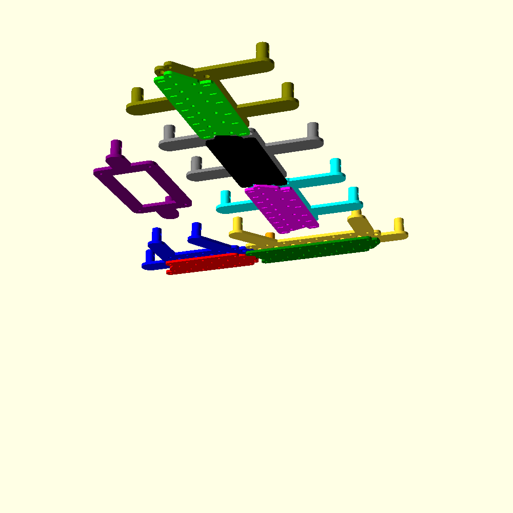

# Hardware Chassis CAD Files

These files make up the chassis, which is mounted behind the face plate and holds all of the lights in place. The chassis has been broken down into a few pieces in order to keep print times/sizes reasonable. They may be consolidated down the road, but not until the design is finalized.

Some important notes:
* The DXF files are derived from the original vector graphics, so (in theory) there is a single point of truth for the placement of of the lights. However, the files have been broken down and copied into this directory.  If you change the parameters of this build, the DXF files here need to be manually updated.  For now, at least.
* The SCAD files are *dynaimcally* derived from the DXF files.  If the DXF files change, the SCAD files in this directory will automatically update. There is also an "assembly" SCAD file that virtually assembles the other SCAD files, so you can see an up-to-date picture of the build at any time. **CHECK THIS OFTEN IF YOU ARE CHANGING ANYTHING!**
* The STL files have all been generated from the SCAD files.  You can regenerate by executing the build script in this directory (`build_stl_files.sh`). You must have `openscad` installed and accessible via the command line.  The script will also render a preview of the complete assembly:

 

### Brief Description of Assembly

The lip of each LED is sandwiched between two 3D printed pieces. The front piece has guiding holes for screws, as well as the bulbs themselves. The back piece has matching screw holes and slits to allow the leads through. A "barrel" is screwed on top of each bulb where it pokes through the front piece to focus/diffuse the light. So, each screw runs through the back piece, the front piece, and a nut housed in the "barrel".